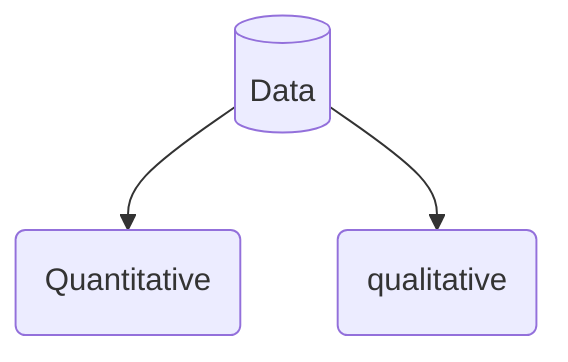

# DS1_2305 (Data Skills 1)

## Overview
| week      |Class      |
|-----------|-----------|
| Week 2: 	|Maths refresher 					
| Week 3: 	|Decimals  					
| Week 4: 	|Percentages & Fractions					 
| Week 5: 	|Ratios 						
| Week 6:	|In-class progress test				
| Week 7: 	|Mean, Median, Mode & Range 				
| Week 8: 	|Pay	
| Week 9: 	|Banking & Finance 
| Week 10:  |Mock Exam  
| Week 11:  |Final Revision 
| Week 12:  |Final Exam  	 
## Assessment 
- Final exam in Week 12 
- 20 questions to be completed in 1 hour 
- Will be through the VLE
- Able to use a calculator 

## Coursebook
- Business Math Brief

## Specific Goals
- Numeracy skills
- Interpreting data 
- Critical thinking 
---

## Questions 
## 1. What is data ?

## Quantiative data
- Data used to quantify a problem
- Can be counted or compared on numeric scale
- usually gathered using instruments 
  1. Rating scale
     - questionnaire
  2. Thermometre
     - Harvest Weather data
  3. Statistical software 
     - SPSS used for quantitative data analysis 

## Qualitative data
