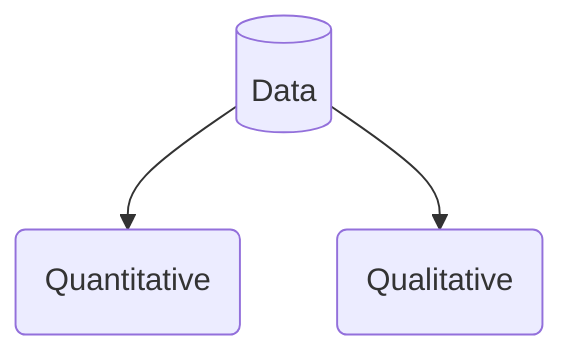

# DS1_2305 (Data Skills 1)
- [DS1\_2305 (Data Skills 1)](#ds1_2305-data-skills-1)
  - [Overview](#overview)
  - [Assessment](#assessment)
  - [Coursebook](#coursebook)
  - [Specific Goals](#specific-goals)
  - [Questions](#questions)
  - [1. What is data ?](#1-what-is-data-)
  - [Quantiative data](#quantiative-data)
  - [Qualitative data](#qualitative-data)

## Overview
| week      |Class      |
|-----------|-----------|
| Week 2: 	|Maths refresher 					
| Week 3: 	|Decimals  					
| Week 4: 	|Percentages & Fractions					 
| Week 5: 	|Ratios 						
| Week 6:	|In-class progress test				
| Week 7: 	|Mean, Median, Mode & Range 				
| Week 8: 	|Pay	
| Week 9: 	|Banking & Finance 
| Week 10:  |Mock Exam  
| Week 11:  |Final Revision 
| Week 12:  |Final Exam  	 
## Assessment 
- Final exam in Week 12 
- 20 questions to be completed in 1 hour 
- Will be through the VLE
- Able to use a calculator 

## Coursebook
- Business Math Brief

## Specific Goals
- Numeracy skills
- Interpreting data 
- Critical thinking 
---

## Questions 
## 1. What is data ?

## Quantiative data
- Data used to quantify a problem
- Can be counted or compared on numeric scale
- Usually gathered using instruments 
- Rating scale used for questionnaires
- Thermometre used to collect  Weather data
- Statistical software 
  SPSS used for quantitative data analysis 

## Qualitative data
- Collected using questionnaires interviews or observation 
- Describes qualities or characterstics
- Data in form of descriptive words 
- Dificult to precisely measure and analyze
- Freuently appers in narrative form
