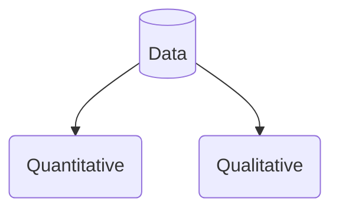

- [1. What is data ?](#1-what-is-data-)
- [Quantitative data](#quantitative-data)
- [Qualitative data](#qualitative-data)
- [Primary v. secondary data](#primary-v-secondary-data)
- [Data treasure hunt](#data-treasure-hunt)

## 1. What is data ?

## Quantitative data
- Data used to quantify a problem
- Can be counted or compared on numeric scale
- Usually gathered using instruments 
- Rating scale used for questionnaires
- Thermometer used to collect  Weather data
- Statistical software 
  SPSS  used for quantitative data analysis 

## Qualitative data
- Describes qualities or characteristics 
- Collected using questionnaires interviews or observation   
- Frequently  appears in narrative form
- notes taken about a quality of goods or services
- response to a questionnaires
- Maybe difficult to precisely measure and analyze
- The data may be in the form of descriptive words that can be examined for patterns or meaning
- Coding  allows researchers to categorize  **qualitative** data
  to identify themes that correspond with research questions and preform **quantitative** analysis. 

## Primary v. secondary data 

- Primary data 
  - data that has been collected from the original source for a specific purpose, for example, if a school wanted to know what their students thought of the school canteen service they would question the pupils directly

- Secondary data 
  - data that is not originally collected by a group for a specific purpose, for example, finding out the average cost of cars in a car park by using national statistics

## Data treasure hunt

- Source used 
  - [GOV.UK](https://www.gov.uk/)
  - [The Office for National Statistics](https://www.ons.gov.uk/) 
  - [International Monetary Fund](https://www.imf.org/)
  - [World bank](https://ourworldindata.org/life-expectancy)
1. What is the population of the UK?  
   - UK population size in mid-2021 is estimated to be 67.0 million (67,026,292).
2. Which region of the UK has the highest average individual wealth? 
   - South East England has the highest average individual wealth    
3. What are the top three richest countries in the world? 
   1. USA
   2. China
   3. Japan 
4. What is the life expectancy in the United States?
   -   77 (77.2)  years`
5. What is the most populous city in the world?
   -  Tokyo is the most populous city in the world with 40 million (37,274,002) residents.
6. What is the average house price in London? 
   - The average house price in London is Half a million (£523.66) 

